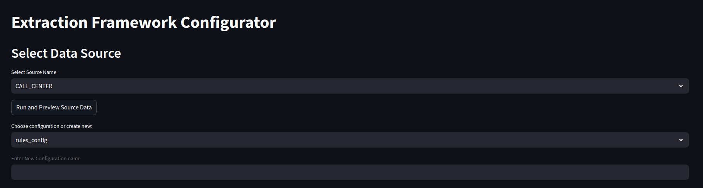
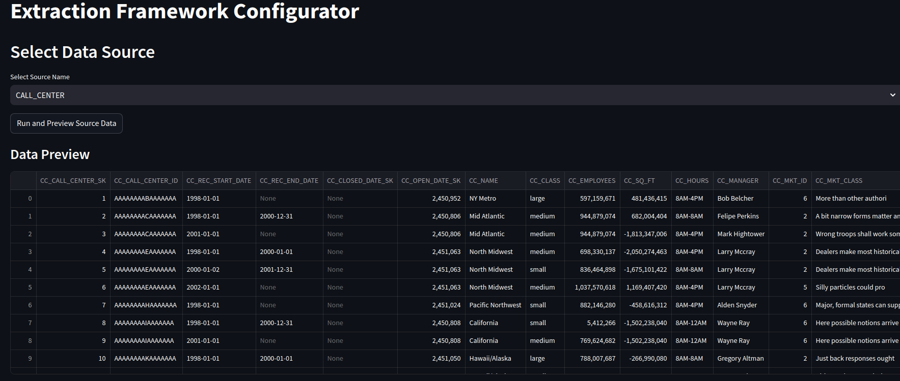
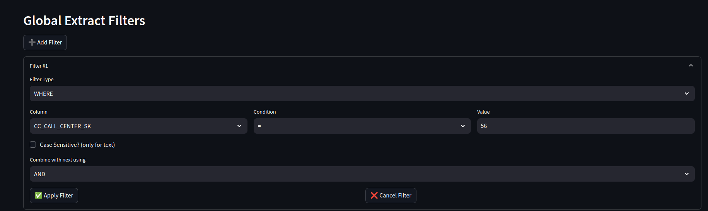
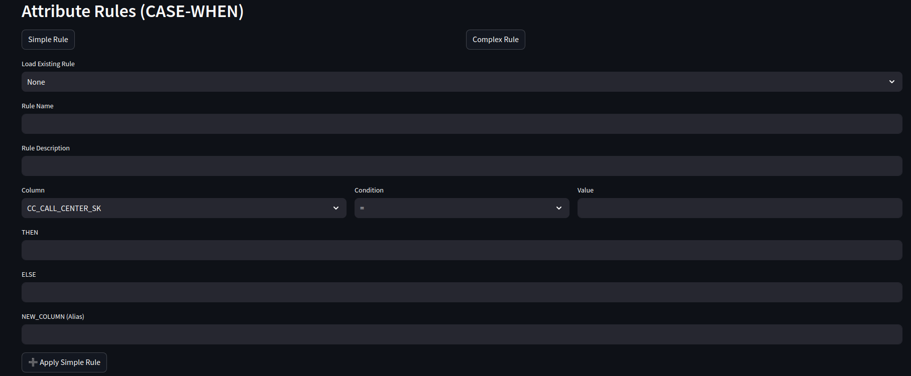
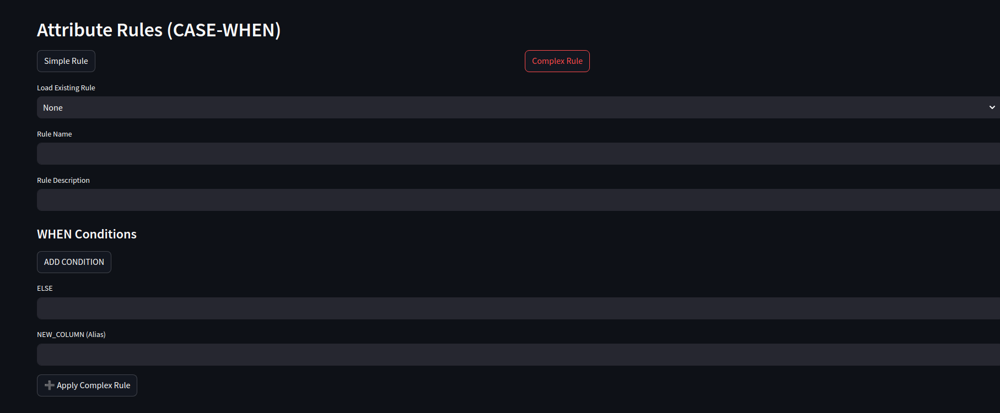
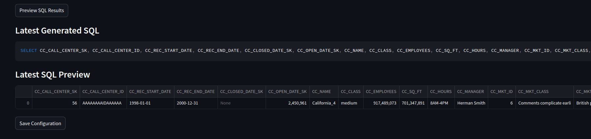

# Case Study Project (Streamlit + Snowflake Integration)

This project is a modular Streamlit-based web app designed to interact with Snowflake and dynamically configure filters, rules, and SQL views for data exploration and transformation.

---

## 🚀 Features

- Dynamic Filter Builder (WHERE, IN, BETWEEN)
- Rule Engine with Simple and Complex Rules
- JSON Rule Import/Export Support
- SQL Generator from Configured Filters and Rules
- View Creation in Snowflake
- Clean modular UI with Streamlit Components

---

## 🏗 Project Structure

## 📁 Module Responsibilities

| Folder / File                | Description |
|-----------------------------|-------------|
| `app.py`                    | Main entry point for the Streamlit application |
| `config/`                   | Business logic for rules, filters, and configuration handling |
| `config_file/`              | Contains JSON rule/filter templates |
| `data_source/`              | DB-related logic (e.g., `get_columns`, connectors) |
| `ui_components/`            | Streamlit UIs for filters, rules, and dynamic widgets |
| `utils/`                    | Utility functions for SQL generation, validation, etc. |
| `.streamlit/`               | Streamlit theme, credentials, etc. |
| `requirements.txt`         | Dependencies |

## 🧪 Workflow Flow

1. **User selects a table** (Snowflake-connected).
2. UI shows “Add Filter” / “Add Rule” buttons.
3. Rules can be:
   - Created from scratch
   - Loaded from JSON
4. After rule configuration:
   - SQL is generated
   - A Snowflake view can be created

---

## 🛠 Setup Instructions

```bash
# 1. Create and activate virtual environment
python -m venv venv
source venv/bin/activate  # Windows: venv\Scripts\activate

# 2. Install requirements
pip install -r requirements.txt

#3. Set Snowflake credentials in .streamlit/secrets.toml:
[snowflake]
user = "YOUR_USER"
password = "YOUR_PASS"
account = "YOUR_ACCOUNT"
warehouse = "YOUR_WAREHOUSE"
database = "YOUR_DB"
schema = "YOUR_SCHEMA"

#4. Run the app
streamlit run app.py  
```


# Screenshots
## Select Data Source


## Data Preview


## Global Extract Filter


## Simple Rule Section


## Complex Rule Section


## SQL Result Section



